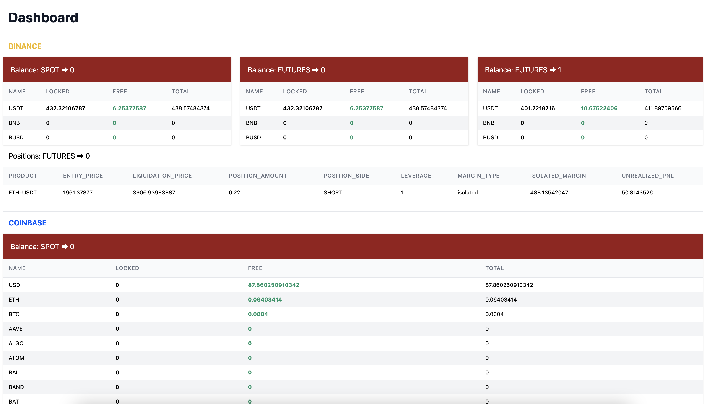

This is a [Next.js](https://nextjs.org/) project bootstrapped with [`create-next-app`](https://github.com/vercel/next.js/tree/canary/packages/create-next-app).

## Getting Started

First, run the development server:

```bash
npm run dev
# or
yarn dev
```

Open [http://localhost:3000](http://localhost:3000) with your browser to see the result.

You can start editing the page by modifying `pages/index.js`. The page auto-updates as you edit the file.


The `pages/api` directory is mapped to `/api/*`. Files in this directory are treated as [API routes](https://nextjs.org/docs/api-routes/introduction) instead of React pages.

Should work fine: 
```
curl -X GET "http://localhost:3000/api/v1/extended/profile"

curl -X GET "http://localhost:3000/api/v1/portfolio/futures/balance?profileId=14"

curl -X GET "http://localhost:3000/api/v1/portfolio/perpetual/position?profileId=14"
```

